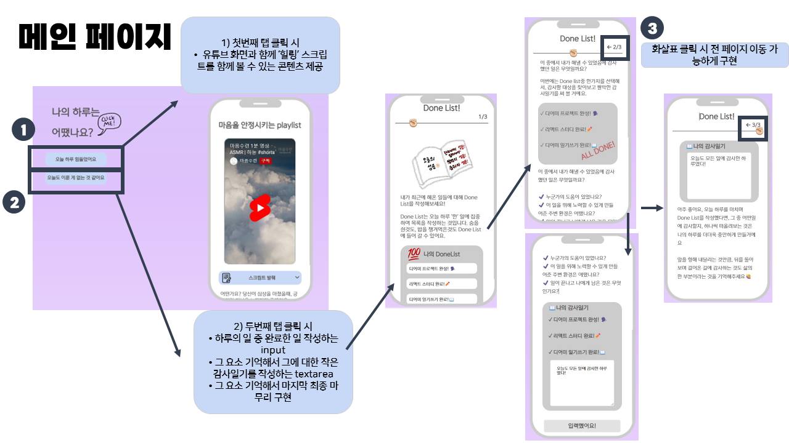
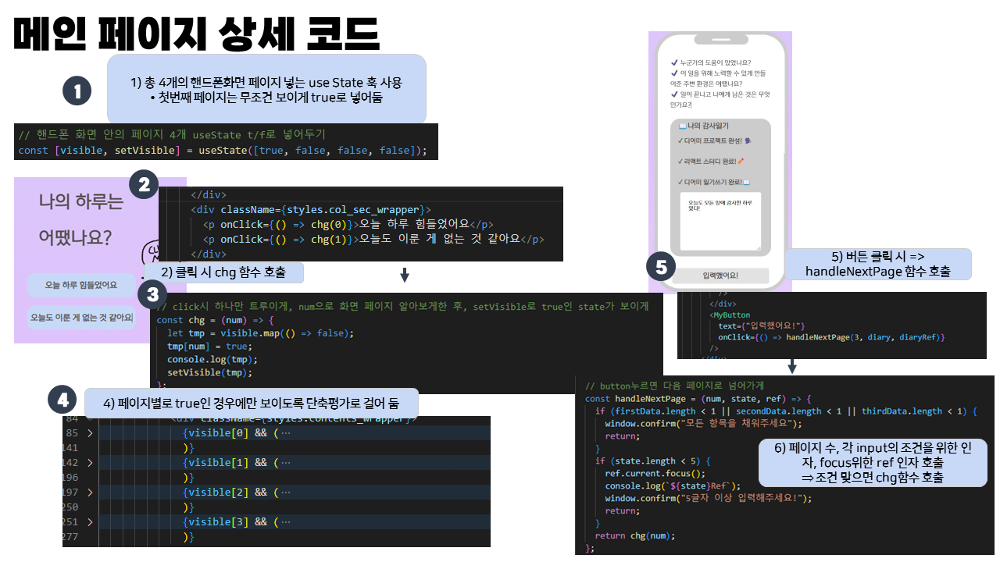
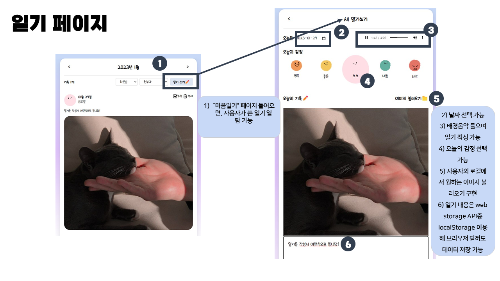
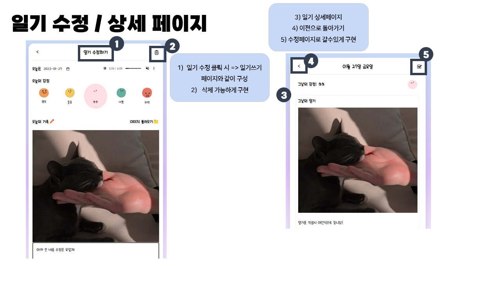
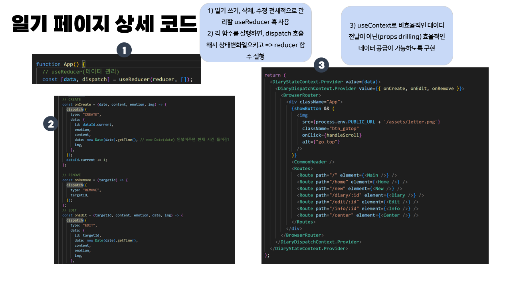
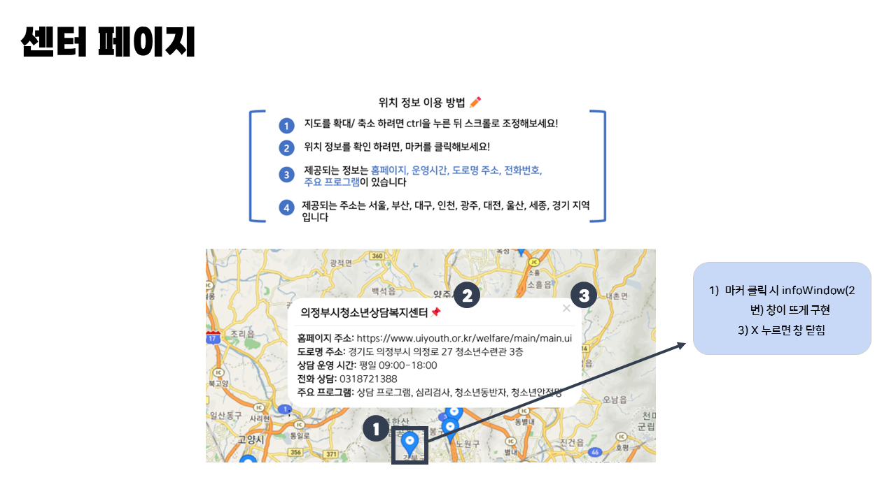
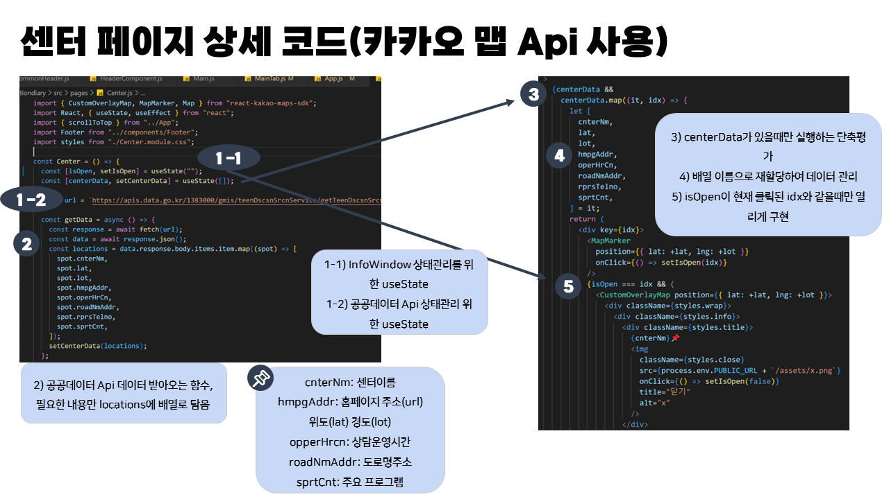

# Dearme,

   
  
   

## 프로젝트 일정 및 전체정리(노션)

[![notion]](https://harmless-patio-fe8.notion.site/Dear-me-33fbc63ed718428d95881151816653b3)
(클릭시 노션 페이지로 이동)
 

## 프로젝트 목표

지친 현대인들의 오늘을 기록할 수 있는 나만의 일기장”을 컨셉으로 기획부터 구현까지 완성했습니다. 

 

## 프로젝트 기간

2023년 1월 16일 ~ 2023년 1월 27일 ( 12일 소요)

 

## 팀 개발 환경

  - <b>운영체제</b>	: Window
   
- <b>개발도구</b>	: Visual Studio Code, Oven(카카오 Prototyping tool)
   
- <b>Language</b>: React, Html5, CSS3, JavaScript
   
- <b>버전관리 시스템</b>	: Git Desktop
   
- <b>배포</b>	: Firebase
   

 

## 나의 기술 스택

| JavaScript |  HTML   |  CSS   |  React   |  Node   |
| :--------: | :-----: | :----: | :------: | :-----: |
|   ![js]    | ![html] | ![css] | ![react] | ![node] |

 

## 구현 기능

### 기능 1

   
  
   

### 기능 2

   
    
   

### 기능 3

   
  
   

### 기능 4

   
  
   

### 기능 5

   
  
   

### 기능 6

   
  
   

### 기능 7

   
  
   

 

## 라이센스

MIT &copy; [NoHack](mailto:lbjp114@gmail.com)

<!-- Stack Icon Refernces -->

[js]: ./images/stack/javascript.svg
[html]: ./images/stack/html.svg
[css]: ./images/stack/css.svg
[notion]: ./images/stack/notion.svg
[react]: /images/stack/react.svg
[node]: /images/stack/node.svg
